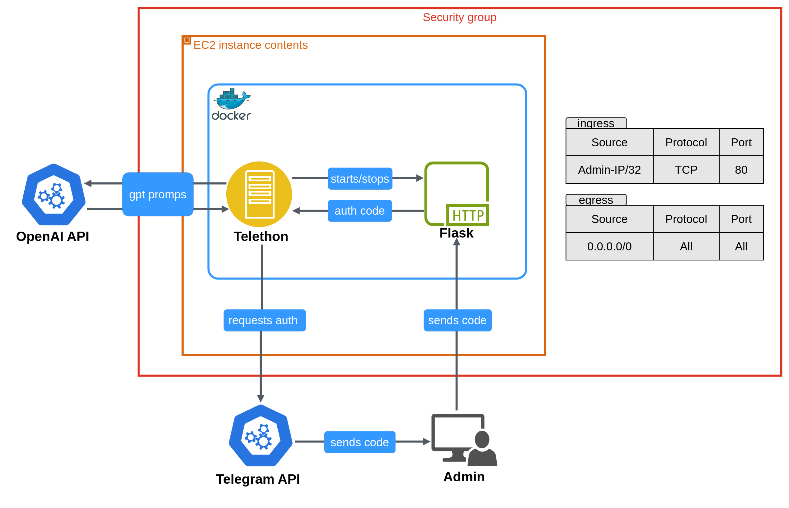

# Echo-Chan


**Echo-Chan** is a Telegram app that receives messages from an input channel, translates them, and forwards them to an output channel. The app uses OpenAI GPT to translate the messages and utilizes the Telegram API for communication.

## How it works
- The app listens for incoming messages in a Telegram input channel.
- It translates the text using OpenAI GPT and sends it along with any associated media to an output channel.
- The app can also process album messages that contain multiple parts of a single message.


## Project structure

```text
.
├── main.py
├── src/      
│    ├── config.py
│    ├── clients/ 
│    │   ├── openai.py
│    │   └── telegram.py
│    ├── services/
│    │   ├── messages.py
│    │   └── translation.py
│    ├── templates/
│    │   └── index.html
│    └── utils.py
```

## Requirements
- Python 3.13
- An OpenAI API key
- A Telegram API ID
- A Telegram API Hash

## AWS Setup Overview


This setup uses one single Availability Zone, one public subnet, and one EC2 instance.

It's definitely not production-ready,there's no high availability, no horizontal scaling, and everything sits in a public subnet.

However, the goal here was to keep things simple and easy to follow for training and learning purposes.

## EC2 Setup Overview


The Flask server is secured as well as possible for now, though improvements are still possible. It runs on an open HTTP port 80 (not secure!), but access is restricted to the committing admin’s IP address, which is provided as a variable during `terraform apply`.

Once the user logs in to the EC2 instance, the Flask server shuts down. The Telethon event loop takes over and continuously handles incoming requests and events, managing the interaction with the Telegram channels.

## Installation
### 1. Create a virtual environment
Create a virtual environment to isolate dependencies:
```bash
python -m venv venv
```

Activate the virtual environment:
- Linux/macOS:
```bash
source venv/bin/activate
```

- Windows:
```bash
venv\Scripts\activate
```
### 2. Install dependencies
Install all required dependencies defined in requirements.txt:
```bash
pip install -r requirements.txt
```

### 3. Configure environment variables
Create a .env file in the root directory and add your API keys and tokens:

```bash
OPENAI_API_KEY=<your-openai-api-key>
TELEGRAM_API_ID=<your-telegram-api-id>
TELEGRAM_API_HASH=<your-telegram-api-hash>
INPUT_CHANNEL=<your-input-channel-id>
OUTPUT_CHANNEL=<your-output-channel-id>
```

### 4. Start the app
Start the app with the following command:
```bash
python main.py
```
After login, the app will begin listening for messages in the INPUT_CHANNEL and send them to the OUTPUT_CHANNEL after translation.

## License
This project is licensed under the MIT License.